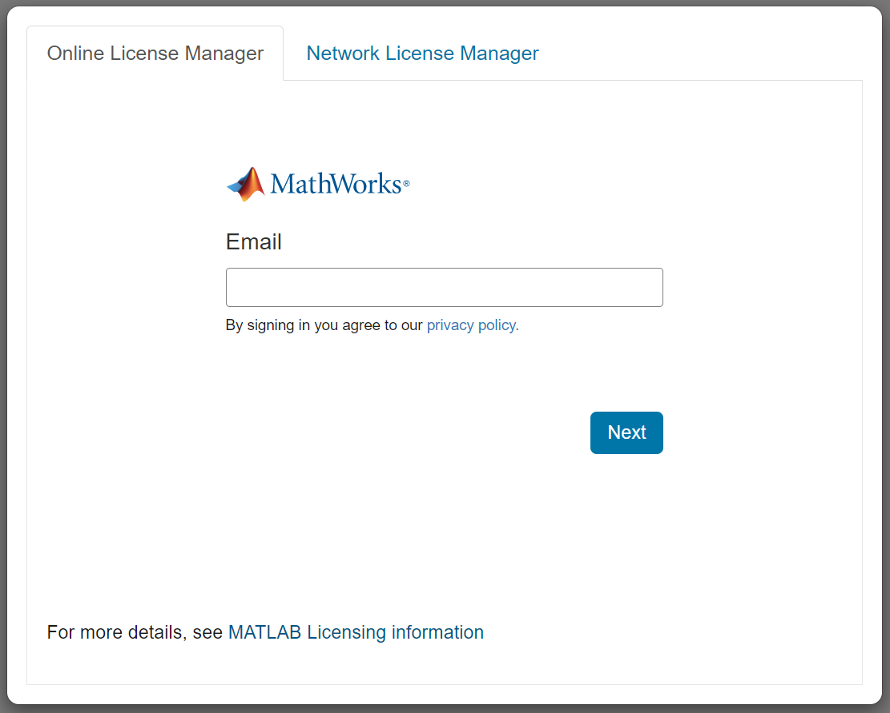

# MATLAB Licensing Info

**For End Users**:

When starting MATLAB through this integration, you are presented with a user interface with two options to set up MATLAB licensing.

  

To choose the right option, determine what MATLAB licenses you have access to. Your license must be current on [MathWorks® Software Maintenance Service](https://www.mathworks.com/services/maintenance.html). 

If you are an academic user, you can use [this tool](https://www.mathworks.com/licensecenter/licenses/add) to determine if you have access to a campus-wide license through your institution. Otherwise, to see the licenses linked to your account, log in to your MathWorks account and go to [License Center](https://www.mathworks.com/licensecenter/?s_tid=hp_ff_s_license). You can link your MathWorks account with a license using [this tool](https://www.mathworks.com/licensecenter/licenses/add).

Based on the license that you want to use, you can follow the procedures outlined in the table below to setup the MATLAB licensing for this integration.

| License Type | Procedure |
| ------ | ------ |
| Individual (that only you use and is in your name; not a Home or Student)  | Your license is already configured for use with MATLAB Integration for Jupyter. Using the _Online License Manager_ tab, enter the credentials to your MathWorks account to get started.   |
| Campus-Wide License | Your license is already configured for use with MATLAB Integration for Jupyter. Using the _Online License Manager_ tab, enter the credentials to your MathWorks account to get started.  |
| Home and Student (that only you use and is in your name)  | These license types are not supported for use with MATLAB Integration for Jupyter.   |
| Concurrent and Network Named User  | Using the _Network License Manager_ tab, enter the address to your organization’s network license manager. You can contact your license administrator* to find the address for the network license manager. |

*Not sure who the license administrator is? Sign in to your [MathWorks Account](https://www.mathworks.com/mwaccount/), click the license you are using, then click the tab marked “Contact Administrators”.

**For Administrators**

| Scenario | License Type | Procedure |
| ------ | ------ | ------ |
| You want your users to use online licensing  | Campus-Wide, Individual  | These licenses are already configured for use with MATLAB Integration for Jupyter. When starting MATLAB, an end user will need to log in to their MathWorks account to use the license linked to it. |
| You want your users to use licenses administered using a network license manager   | Campus-Wide, Concurrent, or Network Named User  | You will need to embed the address of your network license manager when deploying the integration for your Jupyter environment. Otherwise, an end user will need to manually enter the address to the network license manager when they start MATLAB. Each instance of MATLAB will consume a license seat. Using network named user licenses is possible but is *not recommended*. All named users will need to be explicitly specified in the license manager options file. Named users may not use MathWorks products on more than two computers simultaneously - specifying a single, generic named user for the integration will not be viable.   |
