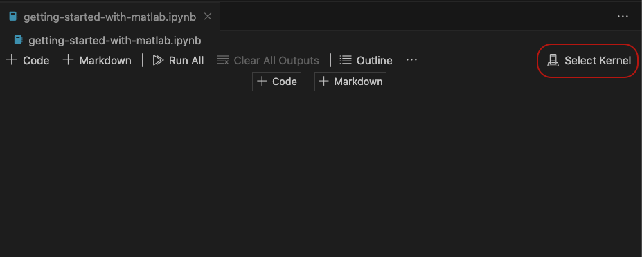
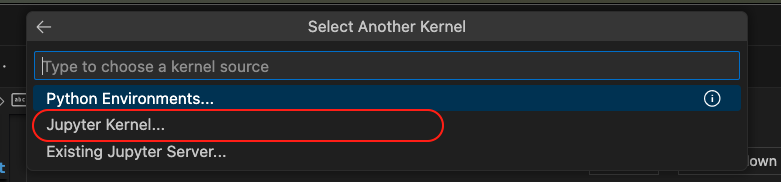
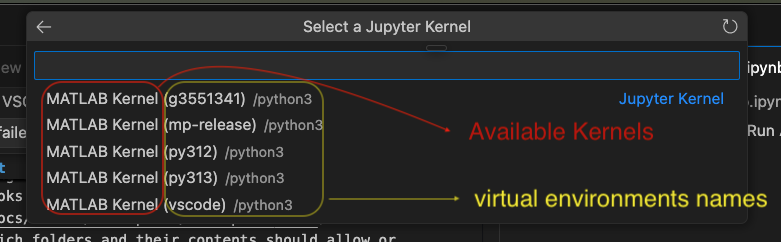
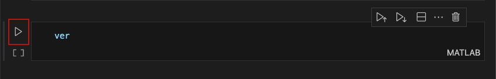
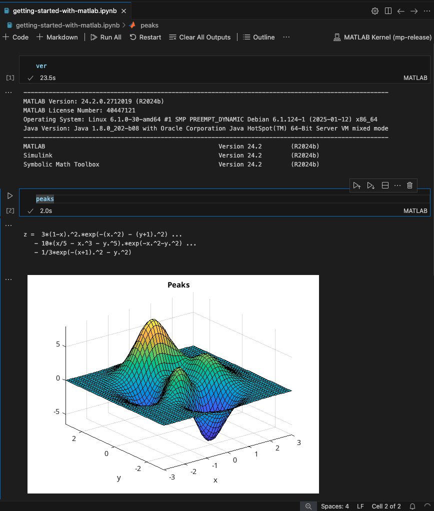

# Run MATLAB in Jupyter Notebooks Using VS Code

This guide shows how to run MATLAB® in Jupyter notebooks using Visual Studio® Code.

## Setup

1. Install [Jupyter Extension for VS Code](https://marketplace.visualstudio.com/items?itemName=ms-toolsai.jupyter).

2. Install [MATLAB Extension for VS Code](https://marketplace.visualstudio.com/items?itemName=MathWorks.language-matlab).

3. Install the [MATLAB Integration for Jupyter](https://github.com/mathworks/jupyter-matlab-proxy) packages in your desired [Python environment (VS Code)](https://code.visualstudio.com/docs/python/environments):

```bash
python3 -m pip install jupyter-matlab-proxy
install-matlab-kernelspec
```

4. Install MATLAB using [MATLAB Package Manager](https://www.mathworks.com/help/install/ug/get-mpm-os-command-line.html). Ensure that MATLAB is available on the system PATH from where you started VS Code.

## Open a Jupyter Notebook and Select the MATLAB Kernel

1. Create a Jupyter Notebook by running the `Create: New Jupyter Notebook` command from the Command Palette (`Ctrl+Shift+P`) or by creating a new `.ipynb` file in your workspace.

2. To start a MATLAB Kernel in a notebook, click **Select Kernel**.

    

3. Click **Jupyter Kernel**.

    

4. Select a MATLAB Kernel from the list of  kernels in your Python environments.

    

5. You see the name of your selected MATLAB kernel on the top right.

    

For more general information about using Jupyter Notebooks in VS Code, see [Create or Open a Jupyter Notebook (VS Code)](https://code.visualstudio.com/docs/datascience/jupyter-notebooks#_create-or-open-a-jupyter-notebook).

## Run Cells

To run a cell, click the **Run** button to the left.



The output of your code is displayed below.




----

Copyright 2025 The MathWorks, Inc.

----
